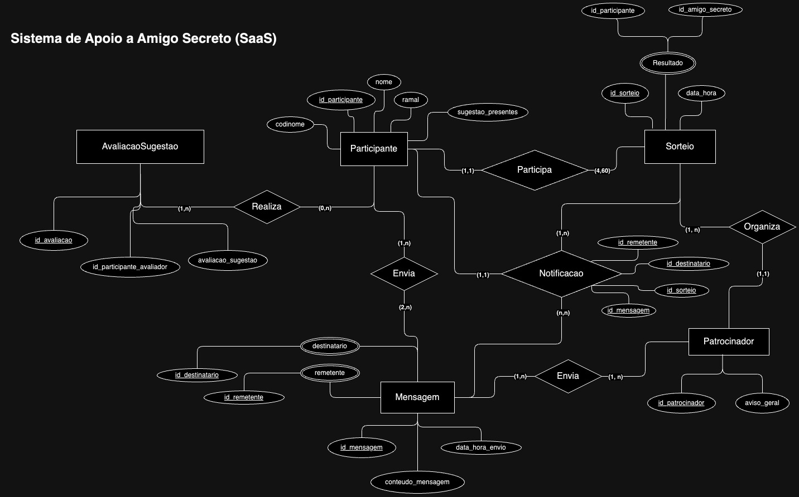
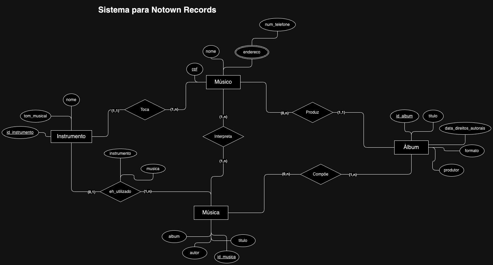

# Data Description Language (DDL)

Entregas a partir dos requisitos de uma Locadora de Filmes e um Sistema de Apoio ao Amigo Secreto:

- Modelagem Relacional
- Mapeamento Relacional 

## Locadora | Modelagem Relacional

### Entidades e atributos | Kaê
**Ator**: 
### Entidades e atributos | Marcio

### Relacionamentos | Kaê
### Relacionamentos | Marcio

## Sistema de Apoio a Amigo Secreto (SAAS) | Modelagem Relacional

### Entidades e atributos | Kaê
**Sorteio**(__id_sorteio__, data_hora, resultado)
**Resultado**(__id_participante, id_amigo_secreto__)
**Patrocinador**(__id_patrocinador__, aviso_geral)
**Mensagem**(__id_patrocinador__, data_hora_envio, conteudo_mensagem, remetente, destinatario)
**Participante**(__id_participante__, codinome, nome, ramal, sugestao_presente)
**AvaliacaoSugestao**(__id_avaliacao__, id_participante_avaliador, avaliacao_sugestao)

### Entidades e atributos | Marcio
**Participante**(_codinome_, eh_patrocin)
**Mensagem**(_ID_, eh_aviso, msg)
**Sugestao** <entidade_fraca>(_descricao_)
**Presente** <entidade_fraca>(_descricao_)

### Relacionamentos | Kaê
**Participa**: Participante (1,1) e Sorteio (4, 60)
**Organiza**: Sorteio (1,n) e Patrocinador (1,1)
**Envia**: Participante (1,n) e Mensagem (2,n)
**Realiza**: Participante (0,n) e AvaliacaoSugestao (1,n)

### Relacionamentos | Marcio
**Envia**: Participante (0,n) e Mensagem (1,1)
**Recebe**: Participante (0,n) e Mensagem (1,1)
**Faz**: Participante (1,n) e Sugestão (1,1)
**Cadastra**: Presente (1,1) e Participante (0,n)
**Sortear**: Participante (1,n)

## Notown Records | Modelagem Relacional

### Entidades e atributos | Kaê
**Álbum**: (__id_album__, formato, titulo, data_direitos_autorais, produtor)
**Música**: (__id_musica__, titulo, album, autor)
**Instrumento**: (__id_instrumento__, tom_musical, nome)
**Endereco**: (__num_telefone__)
**Músico**: (_cpf_, nome)

### Entidades e atributos | Marcio
**Álbum**: (_id_, formato, titulo, data)
**Música**: (_id_, titulo)
**Instrumento**: (__tom_, _nome__)
**Endereco**: (_telefone_, cep, logradouro)
**Músico**: (_cpf_, nome, telefone)

### Relacionamentos | Kaê
**Produz**: Músico (0,n) e Álbum (1,1)
**Compõe**: Músico (0,n), Álbum (1,n) ou Música (1,n)
**Interpreta**: Músico (1,n), Música (1,n)
**Toca**: Músico (1,n), Instrumento (1,1)
**eh_utilizado**: Instrumento (0,1) e Música (1,n)

### Relacionamentos | Marcio
**Produz**: Músico (0,n) e Álbum (1,1)
**Escreve**: Músico (0,n), Álbum (1,n) ou Música (1,n)
**Participa**: Músico (0,n) e Música (1,n)
**Interpreta**: Músico (1,n), Música (0,n) ou Instrumento (0,n)
**Possui**: Música (1,n) e Álbum (1,n)
**Contém**: Música (0,n) e Instrumento (0,n)
**Mora**: Endereço (1,n) e Músico (1,n)