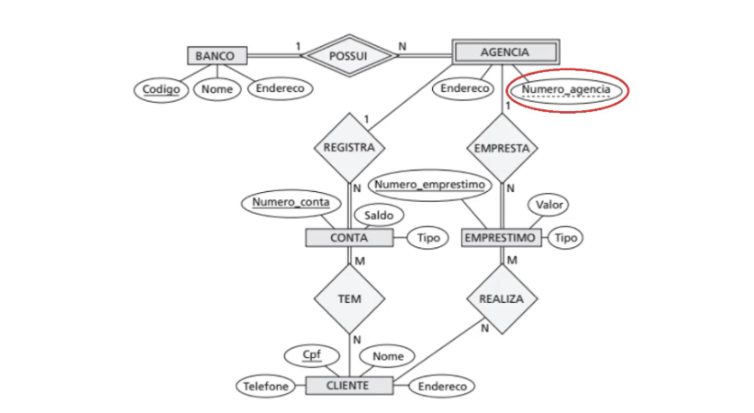

# Mapeamento Relacional | Fintech

## Entidades, Atributos e Relacionamentos

- cliente(_cpf_: varchar(14), nome: varchar(36), telefone: varchar(18), endereco: varchar(50))

- conta(_num_: int, saldo: float, tipo: varchar(36))

- emprestimo(_num_: int, valor: float, tipo: varchar(36))

- conta_cliente(**num_cliente**: int, **num_conta**: int)

- emprestimo_cliente(**num_cliente**: int, **num_emprestimo**: int)

- agencia(_num_: int, endereco: varchar(50))

- conta_agencia(**num_conta**: int, **num_agencia**: int)

- emprestimo_agencia(**num_emprestimo**: int, **num_agencia**: int)

- banco(_cod_: int, nome: varchar(36), endereco: varchar(36))

- banco_agencia(**cod_banco**: int, **num_agencia**: int)

## PKs

- PK(conta_agencia)= num_conta, num_cliente
- PK(agencia)= num
- PK(emprestimo_cliente)= num_emprestimo, num_cliente
- PK(conta_cliente)= num_conta, num_cliente
- PK(emprestimo)= num
- PK(conta)= num
- PK(cliente)= cpf
- PK(banco) = cod
- PK(banco_agencia) = cod_banco, num_agencia

## FKs

- FKnum_conta(conta_cliente) = PK(conta)
- FKnum_cliente(conta_cliente) = PK(cliente)
- FKnum_cliente(emprestimo_cliente) = PK(cliente)
- FKnum_emprestimo(emprestimo_cliente) = PK(emprestimo)
- FKnum_conta(conta_agencia) = PK(conta)
- FKnum_agencia(conta_agencia) = PK(agencia)
- FKcod_banco(banco_agencia) = PK(conta)
- FKnum_agencia(conta_agencia) = PK(agencia)

## Diagrama Entidade Relacionamento | Conceitual

## Links e Referências

- [Draw.io](https://app.diagrams.net/?src=about#G1SqIw0imWmHGW8u-rhosRAbPcL2ZQadyB#%7B%22pageId%22%3A%22R2lEEEUBdFMjLlhIrx00%22%7D)
