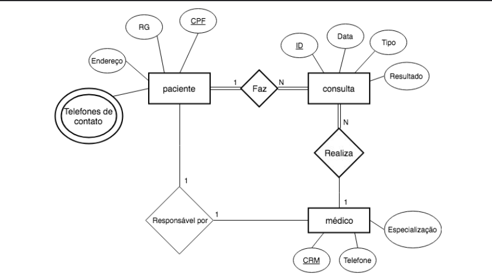

# Mapeamento Relacional | Hospital

## Entidades, Atributos e Relacionamentos

- paciente(_cpf_: varchar(14), rg: varchar(36), **telefones**: varchar(18), endereco: varchar(50))

- consulta(_id_: int, data: date, tipo: varchar(36), resultado: varchar(240))

- medico(_crm_: varchar(9), telefone: varchar(13), especializacao: varchar(36))

- responsavel_paciente(**cpf_paciente**: varchar(14), **crm_medico**: varchar(13))

- telefones_paciente(*num_telefone*: varchar(13),**cpf_paciente**: varchar(14))

## PKs

- PK(paciente)= cpf
- PK(consulta)= id
- PK(medico)= crm
- PK(responsavel_paciente)= cpf_paciente, crm_medico
- PK(telefones_paciente)= num_telefone

## FKs

- FKtelefone(paciente) = PK(telefones_paciente)
- FKcpf_paciente(telefones_paciente) = PK(paciente)
- FKcpf_paciente(responsavel_paciente) = PK(paciente)
- FKcrm_medico(responsavel_paciente) = PK(medico)

## Diagrama Entidade Relacionamento | Conceitual

## Links e Referências

- [Draw.io](https://app.diagrams.net/?src=about#G1SqIw0imWmHGW8u-rhosRAbPcL2ZQadyB#%7B%22pageId%22%3A%22R2lEEEUBdFMjLlhIrx00%22%7D)
