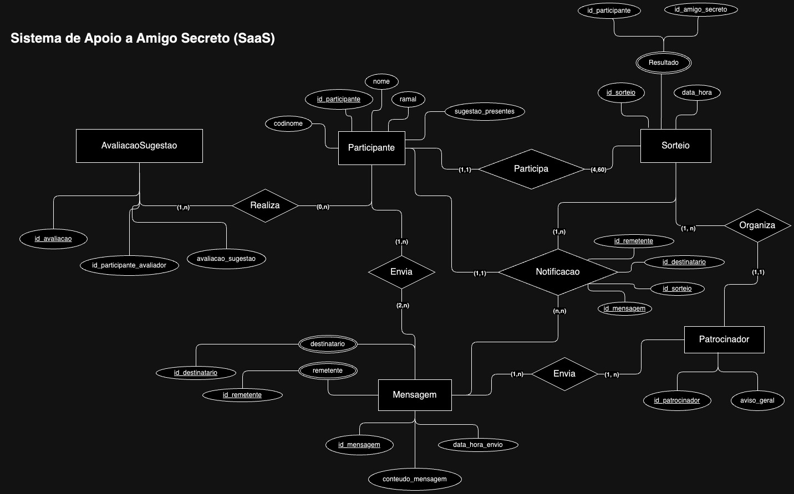

# Mapeamento Relacional | Ami Secreto

## Entidades e Atributos

- Usuário(_cpf_: varchar(14), **codinome**: varchar(14), nome: varchar(36), **eh_patrocinador**: varchar(14))

- Participante(_codinome_: varchar(14),  departamento: varchar(20), **presentes**: varchar(36))

- Patrocinador(_empresa_: varchar(14), msg_transmissao: char(240))

- Mensagens(_id_: timestamp, msg: varchar(240), **remetente**: varchar(14), **destinatario**: varchar(14))

- Sorteio(_id_: timestamp, **participante**: varchar(14), **ami_secreto**: varchar(14), **presente_ami**: varchar(36))

- Lista_Presente(_participante_: varchar(14), presente: varchar(36))

- Avalia_Sugestao(_id_: int, **avaliador**: varchar(14), msg: varchar(240))

## PKs

- PK(Avalia_Sugestao)= id
- PK(Lista_Presente)= codinome
- PK(Mensagem)= id
- PK(Participante)= codinome
- PK(Patrocinador)= empresa
- PK(Sorteio)= id
- PK(Usuario)= cpf

## FKs

- FKusuario_participante(Usuario) = PK(Participante)
- FKavaliador_participante(Avalia_Sugestao) = PK(Usuario)
- FKusuario_recebe(Mensagens) = PK(Usuario)
- FKusuario_destino(Mensagens) = PK(Usuario)
- FKpresentes_participante(Lista_Presente) = PK(Participante)
- FKparticipante(Lista_Presente) = PK(Participante)
- FKami_sorteio(Sorteio) = PK(Participante)
- FKparticipante(Sorteio) = PK(Participante)

### Incompatível

- FKusuario_patrocinador(Usuario) = PK(Patrocinador)

## Diagrama Entidade Relacionamento | Conceitual

## Márcio

## Links e Referências

- [Draw.io](https://app.diagrams.net/?src=about#G1SqIw0imWmHGW8u-rhosRAbPcL2ZQadyB#%7B%22pageId%22%3A%22R2lEEEUBdFMjLlhIrx00%22%7D)
