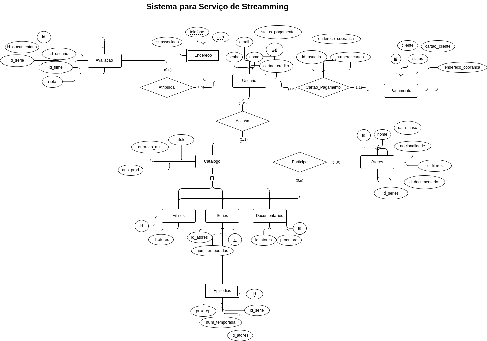

# Entidades e Relacionamentos | Serviço de Stremming

## Questão 1 - Mapeamento Relacional e Inserção de Dados

### Entidades e Atributos

_Italico_: chave primária
__Negrito__: chaves estrangeiras

#### Letra a

Usuario(_cpf_, email, senha, nome, **telefone**, **endereco**, **cartao_credito**, **status_pagamento**)
Endereco(_cep_, _telefone_, **cc_associado**)

#### Letra b

Cartao_Pagamento(*id_usuario*, *num_cartao*, **endereco_cobranca**)
Pagamento(_id_, status, **cliente**, **cartao_cliente**)

#### Letra c

Catalogo(*id_filmes*, *id_series*, *id_documentarios*, titulo, ano_prod, duracao_min)
Filmes(*id*, **id_atores**)
Series(*id*, **id_atores**, num_temporadas, **num_episodios**)
Episodios(*id*, num_temporada, **id_serie**, **id_atores**, **prox_ep**)
Documentarios(*id*, produtora, **id_atores**)

#### Letra d

Avaliacao(*id*, **id_usuario** **id_filme**, **id_serie**, **id_documentario**, nota)

#### Letra e

Atores(id, **id_filmes**, **id_series**, **id_documentarios**, nome, data_nasc, nacionalidade)

### PKs

PK(Usuario)= cpf
PK(Endereco)= cep, telefone
PK(Cartao_Pagamento)= id_usuario, numero_cartao
PK(Pagamento)= id
PK(Catalogo)= id_filmes, id_series, id_documentarios
PK(Filme)= id
PK(Serie)= id
PK(Documentario)= id
PK(Avaliacao)= id
PK(Atores)= id

### FKs

FKusuario_endereco(usuario)= PK(endereco)
FKusuario_telefone(usuario)= PK(endereco)
FKusuario_status_pag(usuario)= PK(pagamento)
FKusuario_cc(usuario)= PK(cartao_usuario)

FKcartao_pagamento(pagamento)= PK(cartao_pagamento)
FKcliente_pagamento(pagamento)= PK(usuario)

FKcatalogo_filmes(catalogo)= PK(filmes)
FKcatalogo_series(catalogo)= PK(series)
FKcatalogo_documentarios(catalogo)= PK(documentarios)

FKatores_filmes(filmes)= PK(atores)
FKatores_series(series)= PK(atores)
FKatores_documentarios(documentarios)= PK(atores)

FKserie_episodio(serie)= PK(episodio)
FKepisodio_serie(episodio)= PK(serie)
FKprox_episodio(episodio)= PK(episodio)+1

FKavaliacao_usuario(avaliacao)= PK(usuario)
FKavaliacao_filme(avaliacao)= PK(filmes)
FKavaliacao_serie(avaliacao)= PK(series)
FKavaliacao_documentario(avaliacao)= PK(documentarios)

FKatores_filmes(atores)= PK(filmes)
FKatores_series(atores)= PK(series)
FKatores_documentarios(atores)= PK(documentarios)

### Implementação(DDL) e Inserção de Dados(DML)

- [export_db]()
- [arquivo_sql](queries.sql)

## Questão 2 - Consulta | DQL

### Letra a: Listar todos os filmes com duração acima de 60 minutos que possuem a participação do ator Arnold Schwarzenegger.

### Letra b: Listar os títulos dos documentários avaliados pela usuária "Gabriela", onde ela realizou uma avaliação com nota acima de 5 (em uma escala de 0 a 10).

