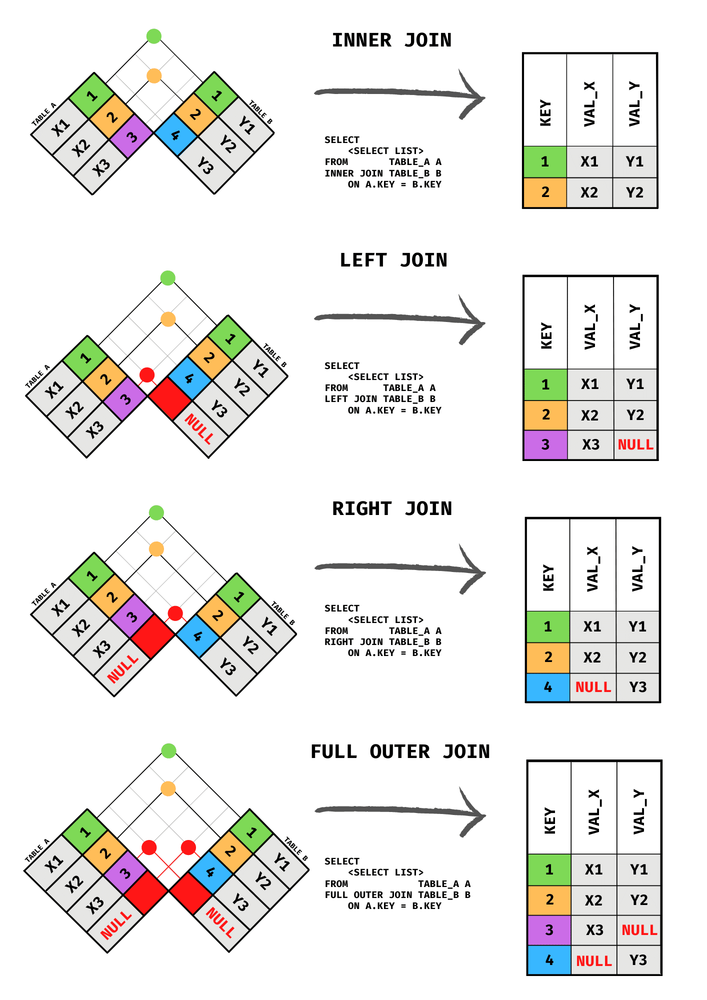

# SQL

## DML | Insert into e Update

### Insert MySQL

    INSERT INTO `Tabela` 
    (`coluna0`, `coluna1`, `coluna2`, `coluna3`) 
    VALUES 
    ('9999999', 'Romeo', 'Vereador', '0001'), ('9999998', 'Moisés', 'Deputado Federal', '0002'), ('9999997', 'Christina', 'Deputado Estadual', '0003'); 

## DQL | Queries

### Regrinhas

### Ordem de execução das consultas SQL

1. `FROM/JOIN`
2. `WHERE`
3. `GROUP BY`
4. `HAVING`
5. `SELECT`
6. `DISTINCT`
7. `ORDER BY`
8. `LIMIT/OFFSET`

### Join

