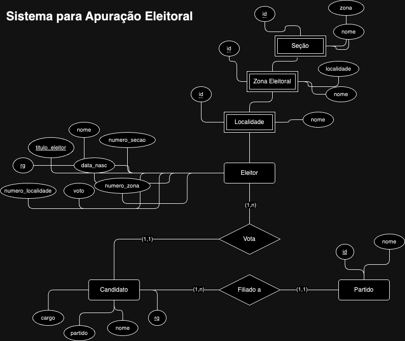

# Sistema Eleitoral

## DDL | Entidades e Atributos

Localidade(_id_, nome)

Zona Eleitoral(_id_, nome, **localidade**)
Seção(_id_, nome, **zona**)

Eleitor(_rg_, *titulo_eleitor*, data_nasc, nome, voto, **numero_localidade**, **numero_secao**, **numero_zona**)

Candidato(_numero_, nome, cargo, **partido**)
Partido(_id_, nome)

### PKs

PK(Localidade)= id
PK(Zona Eleitoral)= id
PK(Seção)= id
PK(Eleitor)= rg, titulo_eleitor
PK(Candidato)= rg
PK(Partido)= id

### FKs

FKzona_localidade(zona)= PK(localidade)

FKsecoes_zona(secoes)= PK(zona eleitoral)

FKeleitor_localidade(eleitor)= PK(localidade)
FKeleitor_zona(eleitor)= PK(zona eleitoral)
FKeleitor_secoes(eleitor)= PK(secoes)

FKcandidato_partido(candidato)= PK(partido)

## DML | Inserção de dados

- [DUMP do Banco com os Dados](./mysql/sistema_eleitoral.sql)

## DQL | Queries

- [Arquivo com as consultas](./mysql/queries.sql)

## Dúvidas

- Será que vai ser melhor eu criar uma tabela só pra armazenar os votos e os respectivos candidatos? Ou, no caso pelo voto ser secreto, o correto é criar essa entidade separada que isto já garante a confidencialidade parcial dos dados?

- Ao reconhecer uma entidade fraca, como o banco de dados sabe (ou como eu demonstro) que ela é fraca?

