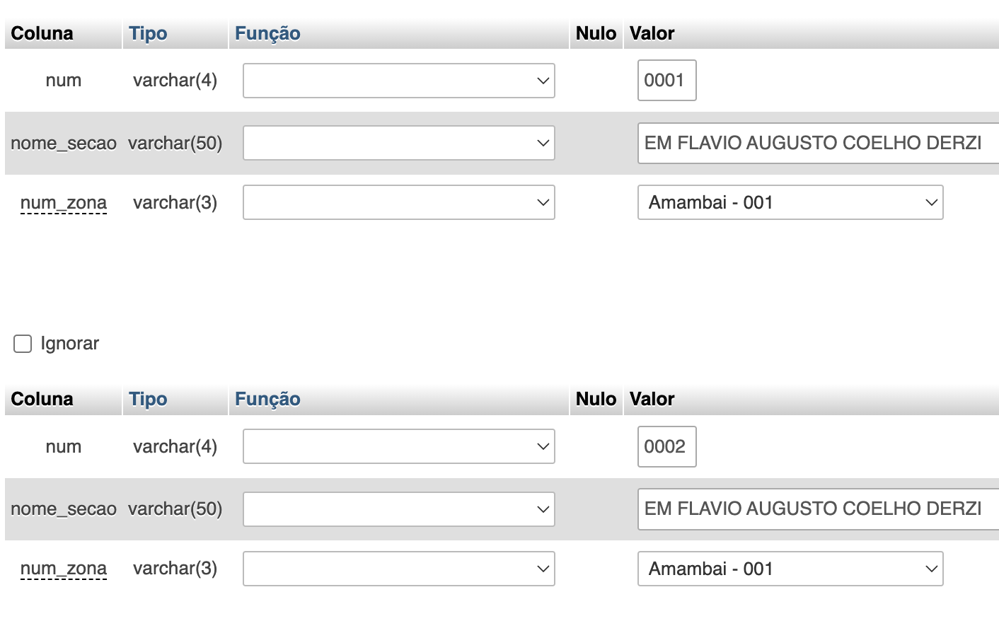

# Sistema Eleitoral

## DDL | Entidades e Atributos

- zona_eleitoral(_num_: varchar(3), nome_cidade: varchar(50))

- secao(_num_: varchar(4), nome_secao: varchar(50), **num_zona**: varchar(3))

- zona_secao(**num_zona**: varchar(3), **num_secao**: varchar(4))

- eleitor(_rg_: varchar(11), *titulo_eleitor*: varchar(12), data_nasc: date, nome: varchar(36), **num_localidade**: int, **num_zona**: vachar(3), **num_secao**: varchar(4))

- candidato(*num*: int, nome: varchar(36), cargo: varchar(50), **num_partido**: int)

- voto(*id_votacao*: timestamp, **num_eleitor**: varchar(12), **num_candidato**: int)

- partido(*num*: int, nome_partido: varchar(36))

### PKs

PK(zona_eleitoral)= num
PK(secao)= num
PK(zona_secao) = num_zona, num_secao
PK(eleitor)= rg, titulo_eleitor
PK(candidato)= num
PK(voto) = id_votacao
PK(partido)= num

### FKs

FKnum_partido(candidato)= PK(partido)

FKnum_localidade(eleitor)= PK(localidade)
FKnum_zona(eleitor)= PK(zona_eleitoral)
FKnum_secao(eleitor)= PK(secao)

FKnum_localidade(localidade_zona)= PK(localidade)
FKnum_zona(localidade_zona)= PK(zona_eleitoral)

FKnum_zona(secao)= PK(zona_eleitoral)

FKnum_eleitor(voto)= PK(eleitor)
FKnum_candidato(voto)= PK(candidato)

FKnum_localidade(zona_eleitoral)= PK(localidade)

FKnum_zona(zona_secao)= PK(zona_eleitoral)
FKnum_secao(zona_secao)= PK(secao)

## DML | Inserção de dados

- [DUMP do Banco com os Dados | 1](./mysql/sistema_eleitoral.sql)

## DQL | Queries

- [Arquivo com as consultas](./mysql/queries.sql)

## Dúvidas

- No caso, pelo voto ser secreto, o correto é criar essa entidade(voto) separada que isto já garante a confidencialidade parcial dos dados?

    Sim, desta forma você separa (a primeiro nível) os dados confidenciais do resultado da votação, apesar de que se for feito um letf join da tabela eleitor com a tabela voto, você consegue saber quem votou em quem.

- Ao reconhecer uma entidade fraca, como o banco de dados sabe (ou como eu demonstro) que ela é fraca? O que implica uma entidade ser fraca ou não se o banco de dados não reconhece isso?

- Ao declarar as chaves de uma tabela no MySQL, qual é a diferença entre marcar aquela coluna como UNIQUE, UNIQUE composta, PRIMARY composta ou como Índice?

- Não é possível atribuir dados duplicados a uma coluna com restrição? 

    INSERT INTO `secao` (`num`, `localidade`, `num_zona`) VALUES ('0004', 'EM FLAVIO COELHO DE ALMEIDA DERZI', '001')
    
    Mensagem do MySQL: Documentação

    #1062 - Entrada '001' duplicada para a chave 'secao.num_zona'

- 

