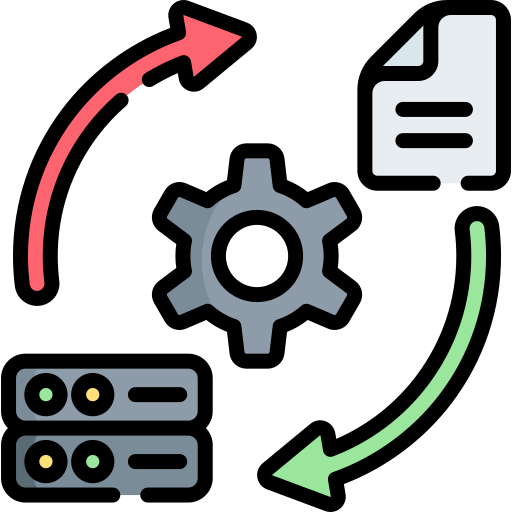

# Central dos Dados 

Hub de dados onde realizo estudos, testes ou projetos mais direcionados a dados.

## Análise Exploratória dos Dados

1. [Problema ou Pergunta]
2. [Coleta de Dados]
3. [Análise]
4. [Modelo]

## Processos

Temos duas possibilidades de execução:

  

    <h3>ETL</h3>
    
Conteúdo da primeira coluna.

    <ol>
        <li><b>E</b>xtração</li>
        <li><b>T</b>ransformação</li>
        <li><b>C</b>arregamento</li>
    </ol>
  

  

    <h3>ELT</h3>
    
Conteúdo da segunda coluna.

    <ol>
        <li><b>E</b>xtração</li>
        <li><b>C</b>arregamento</li>
        <li><b>T</b>ransformação</li>
    </ol>
  

## Cursos em andamento

- [Python para análise de dados | Udemy](https://www.udemy.com/course/python-para-analise-de-dados/learn/lecture/31397630#overview)
- [Análise de dados com Pandas | Udemy](https://www.udemy.com/course/analise-de-dados-com-pandas-t/learn/lecture/39243536?start=0#overview)
- [Pyspark e Nifi: analisando e criando projetos de dados | Udemy](https://www.udemy.com/course/pyspark-e-nifi-analisando-e-criando-projetos-de-dados/learn/lecture/28819182?start=0#overview)
- [Alteryx TRIFACTA e Apache HOP: cargas e tratamento de dados | Udemy](https://www.udemy.com/course/alteryx-trifacta-e-apache-hop-cargas-e-tratamento-de-dados/learn/lecture/35628382?start=0#overview)
- [Dremio e Metabase: Análise de Dados Simplificada | Udemy](https://www.udemy.com/course/dremio-e-metabase-analise-de-dados-simplificada/learn/lecture/39344464?start=0#overview)

## Links e Referências

- [Análise exploratória dos dados](http://www.each.usp.br/lauretto/SIN5008_2011/aula01/aula1)