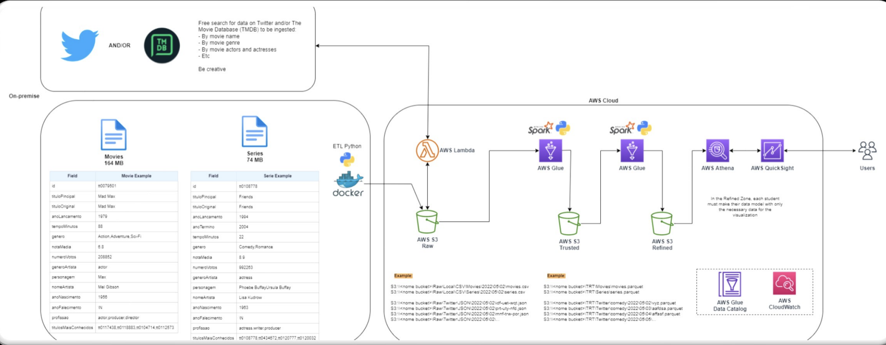

# Desafio Final | CompassUOL

## Sobre

> Este projeto tem como objetivo apropriar os conhecimentos objetidos ao longo de 5 meses.

## Arquitetura do Projeto

## Coleta de dados | Raw

A extração de dados será feita através de uma função periódica utilizando o [AWS Lambda]() a partir de qualquer fonte disponível na internet como o Twitter ou o The Movie DataBase (TMDB).

A coleta poderá ser feita por:

- Nome do filme
- Gênero
- Nome de Atores/Atrizes
- Nome de Personagens
- Etc..

## Armazenamento dos dados | Raw S3

Após ter coletado os dados, seu armazenamento será feito em um bucket do [Amazon S3](), contendo os dados brutos dos filmes e séries selecionados. 

### ETL | Python & Docker

- [Configuração Docker]()