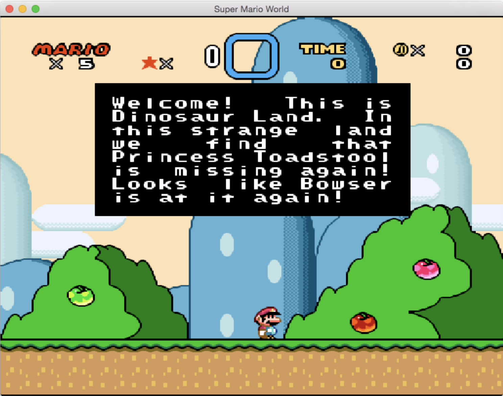
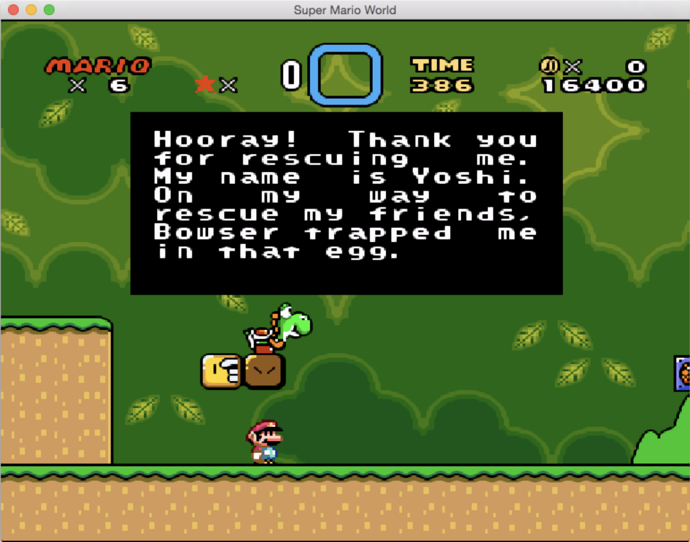
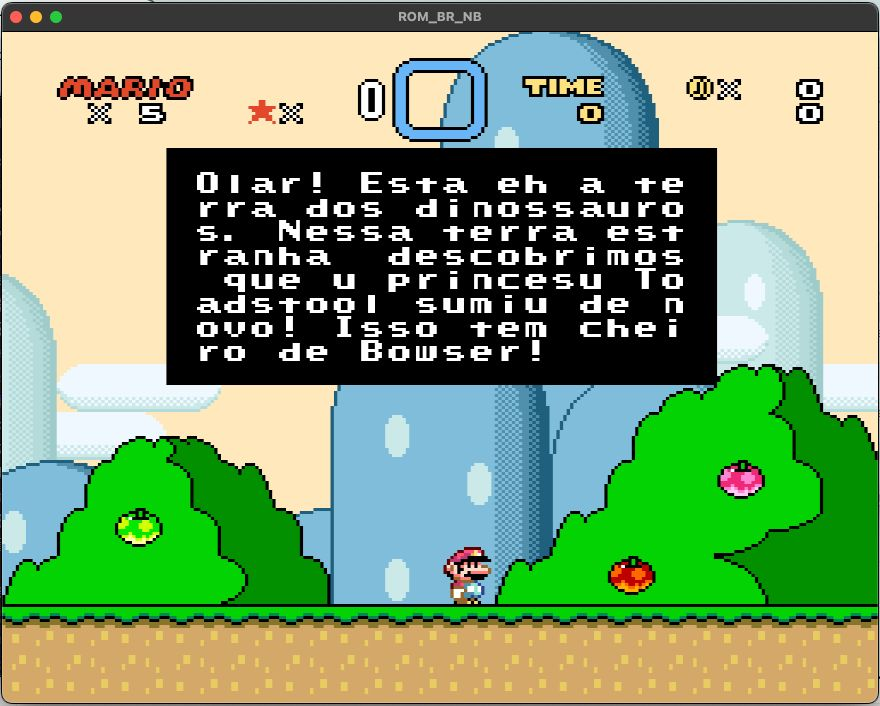
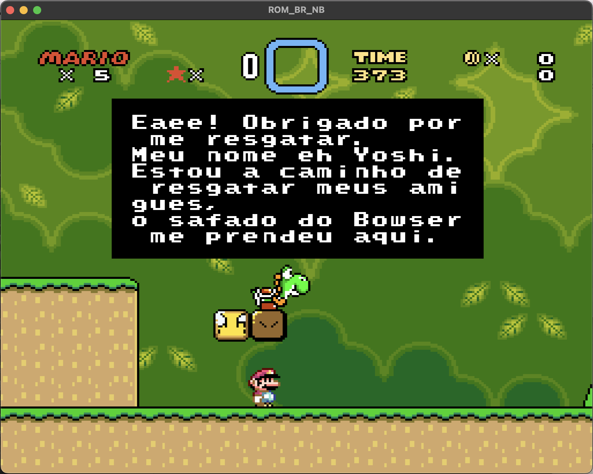

# ROM Hacking Toolkit — Super Mario (SNES)

Este repositório contém três ferramentas para auxiliar na tradução de textos da ROM:

- `finder.py`: busca sequências na ROM usando uma tabela customizada (.tbl).
- `extractor.py`: extrai textos de regiões conhecidas para um CSV editável.
- `injector.py`: injeta o CSV editado de volta na ROM, respeitando o tamanho de cada entrada.

## Textos-alvos




## 1. Tabelas (.tbl)

- Comentários começam com `;` ou `#`.
- Suporta **códigos multi-byte**: `81 40=á`
- Tokens especiais devem ser escritos como `<TOKEN>`, ex.: `<END>`, `<LF>`.

Formato simples linha a linha:

```
HH=caractere
```

Exemplos:

```
41=A
61=a
20= 
00=<END>
```

> Ao colocar novamente o texto, utilizamos duas tabelas: a primeira foi gerada através do programa `Translhextion16c` que nomeamos como `mario_dialogo_raw.tbl` e a segunda foi complementada manualmente `mario_dialogo_hum.tbl`.

- [mario_dialogo_raw.tbl](tabelas/mario_dialogo_raw.tbl)
- [mario_dialogo_hum.tbl](tabelas/mario_dialogo_hum.tbl)

## 2. [finder.py](finder.py)

Busca offsets de uma string (codificada via tabela) ou sequência de bytes exata e retorna na shell.

```
# Usando a tabela ASCII
$ python finder.py SMario.sfc "SUPER MARIOWORLD"

{'offset': '32704 (0x00007FC0)', 'hexadecimal': '53 55 50 45 52 20 4D 41 52 49 4F 57 4F 52 4C 44'}

# Usando a tabela fornecida pelo Translhextion
$ python finder.py SMario.sfc "Welcome" --table tabelas/mario_dialogo_raw.tbl

{'offset': '173529 (0x0002A5D9)', 'hexadecimal': '16 44 4B 42 4E 4C 44'}
```

## 3. [extractor.py](extractor.py)

Extrai textos de regiões da ROM, definidas manualmente em `ranges.json`. Cada entrada gera uma linha no CSV com `offset_dec`, `length` e `text`.

Exemplo de `ranges.json`:

```json
[
  {
    "name": "intro_message",
    "start": "0x00100000",
    "end": "0x00101000",
    "terminator": ["00", "FF", "1C"]
  }
]
```

Uso:

```
$ python extractor.py SMario.sfc tabelas/mario_dialogo_raw.tbl ranges.json out/saida.csv
```

## 4. [injector.py](injector.py)

Lê `traduzido.csv` e grava o texto codificado na cópia da ROM.

```
$ python injector.py SMario.sfc tabelas/mario_dialogo_raw.tbl traduzido.csv ROM_BR_NB.sfc

# se necessário cortar textos que ultrapassem o espaço original:
$ python injector.py SMario.sfc tabelas/mario_dialogo.tbl traduzido.csv ROM_BR_NB.sfc --truncate --pad-byte FF
```

## Fluxo utilizado

1. Scaneamos a ROM pelo programa `Translhextion16c` para gerar a tabela crua do jogo, que nomeamos `mario_dialogo_raw.tbl`.

2. Usamos `finder.py` para descobrir o mapeamento buscando por algumas das palavras dos textos-alvos na ROM:

  > Welcome! This is Dinosaur Land. In this strange land we find that Princess Toadstool is missing again! Looks like Bowser is at it again!
  >
  > Hooray! Thank you for rescuing me. My name is Yoshi. On my way to rescue my friends, Bowser trapped me in that egg

3. Em seguida, identificamos a região da **mensagem inicial** e descrevemos no `ranges.json`.

4. Rodamos `extractor.py` para gerar o CSV com o texto original `saida.csv`.

5. Traduzimos o texto da coluna `text` e renomeamos como `traduzido.csv` prestando atenção ao tamanho do texto original e evitando ultrapassar o tamanho por linha.

6. Rodamos `injector.py` para gerar `ROM_BR_NB.sfc`.

7. Testamos nos emuladores SNES9x e OpenEmu.

## Resultado



