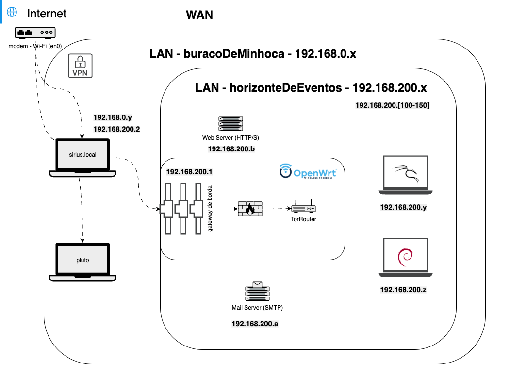

# Configuração da rede Tor

> Este repositório tem o intuito de apresentar de modo prático a instalação de uma rede virtual privada segura a partir do firmeware da OpenWright, configurando a rede Tor. A implementação tem a seguinte esquemática:
>
> 

Você também pode [baixar o artigo no modelo da SBC](TorNetwork.pdf).

